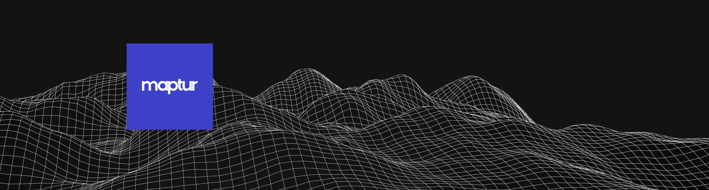
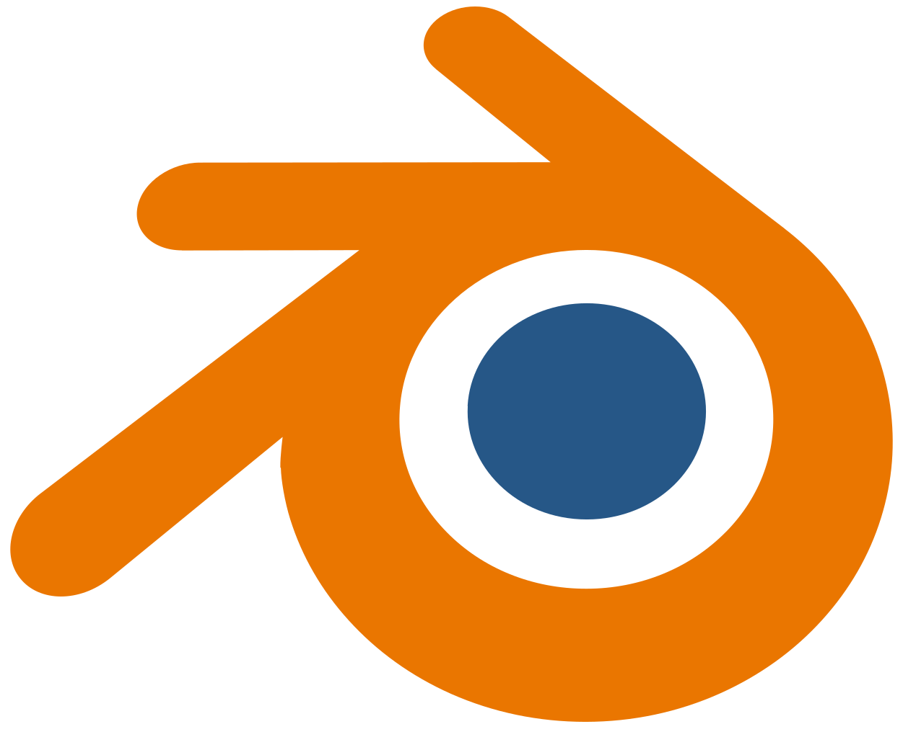
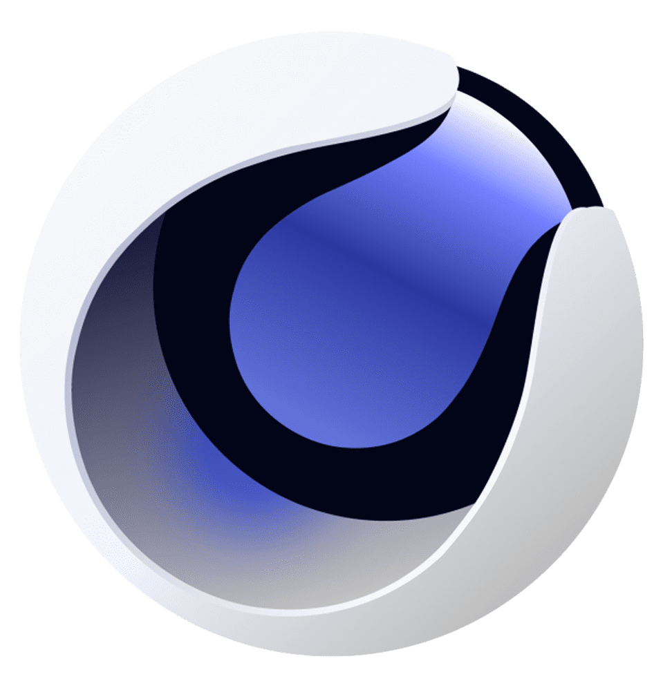

 &nbsp;&nbsp;&nbsp;   &nbsp;&nbsp;&nbsp;&nbsp;&nbsp; &nbsp;&nbsp;&nbsp;&nbsp;&nbsp; 

# Welcome to Maptur
Maptur is a professional 3D positioning and tracking software that converts positioning data from iOS devices in real time into precise and easily usable motion inside of Blender. Built to integrate seamlessly, it allows artists and creators to capture natural movement and translate it directly into their 3D scenes—now moving to a completely free, open-source model.

Features:
- 100% Free & Open Source (No account or login required)
- Real-time motion streaming over WiFi into Blender
- Multi Computer Support
- Logged session recording for future workflows
- Customizable axis control for translation and rotation
- Built-in smoothing to reduce jitter and create cinematic motion
- Dynamic cleanup to prevent data loss during live sessions
- Live viewport monitoring directly on your iPhone

 

---

* The Maptur Blender Addon & Source Code are available directly on GitHub: **[github.com/adiframemedia/maptur](https://github.com/adiframemedia/maptur)**

* The iOS App is coming back soon to the **[App Store](https://apps.apple.com/us/app/maptur/id6751021314)** as a 100% free download with no account required.

* Android App is in development.

 

Follow **[@adiframemedia](https://www.instagram.com/adiframemedia/)** on Instagram to stay tuned on development progress.

Feel free to submit requests on GitHub or Instagram for features you would like to see in the future.

---

## Features and Details
Using Maptur there's 2 main methods of control, **Live Control** and **Captured Logs**. Both methods allow users to make use of the Maptur camera tracking software whether they’re in studio on a local network or completely offline.

### Live Control
Live Control allows you to connect to your computer either via WiFi or Bluetooth in order to send IMU data to your 3D environment in real time. Within our control panel, you can make adjustments such as how you want this data to be applied, which camera it syncs the data to, or which properties you want affected by this. Along with these syncing controls, we also offer an option for smoothing to reduce jitters in the camera movement if needed.

### Captured Logs
Captured Logs allow users to record data sets of camera information when offline and then either send the file to your computer manually or wirelessly sync the data and turn it into usable keyframe data inside Blender.

### Precise Rotation and Translation Control
Using our algorithm we can utilize IMU data from phones and turn this into usable data within 3D environments such as Blender. We make use of AR Functionality for Rotation and Translation movement. For rotation movement you can just use IMU only mode which will allow for slightly faster reporting rates and easier operating when using our free mode.

### Data Smoothing
IMU Data coming in from mobile devices is very precise and even the slightest movement can cause small amounts of jitter to translate into the 3D environment. To help counter this we have an algorithm that can be activated to smooth the data out and eliminate a lot of these small jitters that may produce an unwanted look in the virtual camera movement.

### Precise Data Control
Within the Maptur Control Panel you can adjust what data points of your virtual camera are affected by the streamed data, which may be needed for specific types of filming scenarios. When capturing a log on mobile, you can edit this when importing as well and only apply keyframes to specific parameters.

### Live Viewport Monitoring
You can enable a live viewport monitoring mode which allows users to select a specific camera within a Blender scene and then streams a live feed of the given view directly to your phone. You can make use of any shading type you want since this is an extension of Blender's viewport (Ray Tracing in Cycles performance will be hardware dependent; GPUs with Ray Tracing cores are recommended). 

### Bluetooth Streaming
Within the mobile app you can click on search for device after selecting Bluetooth connection mode and report data in the same way you would over WiFi. Keep in mind that while Bluetooth offers good response time, WiFi provides faster ping times for high frequency settings.

### WiFi Streaming
Maptur will generate a local server on your computer running Blender which will act as a main receiving port for IMU data within live scenarios. If you're using a 3rd party app for IMU reporting such as SensorLog on iOS, you manually enter the IP and port number displayed within the Control Panel. If you're using the Maptur mobile app, all you need to do is click search for network and select the desired machine on your local network.

### Adjustable Live Viewport FPS and Update Rates Control
Within our plugin you can either sync to the timeline FPS of your project or use a custom speed. You can also adjust your update rate independently from your frame rate. When translating to keyframe data, it automatically converts frequency to match your project's target frame rate.

### Mobile App Camera Recording + IMU Data Logging
If you want to record a video on your phone with attached IMU Data, you can use the camera recording functionality within our mobile app which syncs the data with timecode to your IMU Log.

### Quick Video Tracking Feature (Future Update)
Upload a regular video from your phone to the iOS/Android App or directly through the Desktop Addon and our software will analyze all of the frames and turn the camera movement into keyframes usable within Blender. A separate menu will allow you to adjust tracking settings, supported by a predictive cleanup algorithm.

---

# Tutorials and Setup Guides

Upon release we will create a collection of videos and written guides showing users how to set up Maptur and best practices to ensure the best possible results.

### YouTube Videos
- A series of YouTube content will educate users on how to use the plugin and best practices for project setups.
### PDF Instruction Guides
- Step-by-step PDF guides highlighting setup workflows and advanced control features.

---

## Release Roadmap

Below is the planned roadmap for Maptur, detailing upcoming features and expected milestones.

### **Version 1.1.0 - Open Source Release (Upcoming)**
- **Open Source Repository** – Public GitHub repository with open access to Blender addon code and assets.
- **Account-Free Architecture** – Total removal of login systems across desktop and mobile clients.
- **Blender Interface** – Easy-to-use control panel for streaming data and managing keyframes.
- **Live Control & Smoothing** – WiFi and Bluetooth live transmission with real-time jitter reduction.
- **Viewport Streaming** – Real-time viewport feedback streamed directly to mobile screens.

---

## **Future Features in Coming Updates**

### Camera Simulation System
- Simulate the motion and weight of heavier or lighter cameras in a wide range of configurations.
- Simulated effects to enhance motion while recording scenes.

### Video & Streaming
- **Fullscreen Viewport Streaming** - 1080p up to 120FPS (GPU ACCELERATED) *(Windows & macOS Support)*
- **In-App Video Recording** - Record video footage while capturing positioning data.
- **Slow Motion Mode** - Adaptive camera smoothing with cleanup algorithm for virtual slow-motion shots.

### New Calibration Systems
- **Automatic Camera Pivoting Calibration** - For users mounting phones on top of physical cameras.
- **Scene Distance Calibration** - Accurate real-world distance mapping for scene reconstruction.

### Real-Time 3D Preview & Playback
- **3D Scene Preview** - View prerecorded scenes within Blender Renderer or Apple's Metal Renderer.
- **Timeline & Keyframe Control** - Fast forward camera playback, speed adjustments, and frame jumping.
- **Offline Mode** - Full app functionality without an internet connection.

### Camera Data Import Support
Import footage with positioning data from:
- **Sony** *(Rotation Only)*
- **RED** *(Rotation Only)*
- **GoPro** *(Rotation Only)*

### Camera Controls
- **Advanced Camera Smoothing** - Professional-grade smoothing algorithms.
- **Real-time Adjustment Features** - Fine-tune camera parameters on the fly.
- **Enhanced Recording Controls** - Full control over recording settings.

### Future Software Integration

#### 3D Software
- **Blender**
- **Autodesk Maya**
- **Cinema 4D**

#### Game Engines
- **Unreal Engine 5**
- **Unity**

### Future Mobile Platform Support
- **Android**

### Connectivity & Networking
- **Bluetooth Connection**
- **Peer-to-Peer WiFi** Connection Modes
- **Cloud Storage & Syncing**
