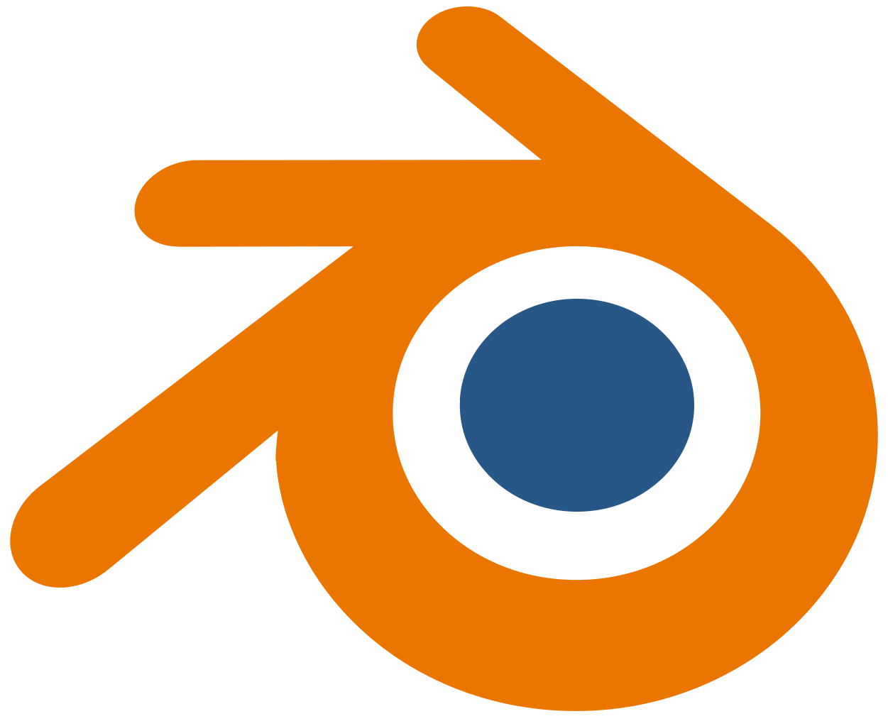

    

# Welcome to Maptur
Maptur is a 3D Tracking Software and Plugin Collective that translates IMU data from mobile devices into usable 3D positioning data for animation software. Currently, it works in Blender but will soon have support in Maxon Cinema 4D, SideFX Houdini, and Autodesk Maya.

---

## Features and Details
Using Maptur there's 2 main methods of control, **Live Control** and **Captured Logs**. Both methods allow users to make use of the Maptur camera tracking software whether they’re in studio on a local network or completely offline.

### Live Control
Live Control allows you to connect to your computer either via WiFi or Bluetooth in order to send IMU data to your 3D environment in real time. Within our control panel, you can make adjustments such as how you want this data to be applied, which camera it syncs the data to, or which properties you want affected by this. Along with these syncing controls, we also offer an option for smoothing to reduce jitters in the camera movement if needed.

### Captured Logs
Captured Logs are a feature that will exclusively be offered for our **Pro** users who have access to our mobile app. This app will be available on iOS first, then the Android release will follow. Utilizing this feature, you will be able to record data sets of camera information for when you're offline and then either send the file to your computer manually or wirelessly sync the data and turn it into usable keyframe data.

### Precise Rotation and Translation Control
Using our algorithim we can utlize IMU data from phones and turn this into usable data wihtin 3d environments such as blender. Our Rotation and Translation features do not utilize LiDAR or any sort of photoprocessing data to function which enables users to orient phones into different ways and does not require the use of the onboard camera currently.

### Data Smoothing
IMU Data coming in from mobile devices is very precise and even the slightest movement can cause small amounts of jitter to translate into the 3d enivornment. To help counter this we have a algorithim that can be activate to smooth the data out and elimate a lot of these small jitters that may produce an unwanted look in the virtual camera movement.

### Precise Data Control
Within the Maptur Control Panel you can adjsut what data points of your virtual camera is effeted by the streamed data which may be needed for specific types of filming scenarios. When using the mobile and capturing a log you can edit this when it's being imported as well and only apply keyframes to specific paramters.

### Live Viewport Monitoring
Exlusive for Pro users with the Maptur Mobile App. You can enable a live viewport monitoring mode which allows users to select a specific camera within a blender scene and then streams a live feed of the given view. You can make use of any shading type you want since this is an extent of blender's viewport but Ray Tracing in Cycles perofrmance will be highly hardware dependent. GPUs with Ray Tracing cores are recommended for this kind of use in real time. 

### Bluetooth Streaming
This feature is exclusive to our pro variant which requires the use of our mobile app. Within the mobile app you will click on search for device after selecting bluetooth connection mode and can report data in the same way you would over WiFi. Keep in mind that while bluetooth offers good response time, you are capable or getting faster ping times through WiFi so if you plan on reporting at a high frequency setting it would be in your best interest to use WiFi instead of bluetooth.

### WiFi Streaming
Maptur will generate a local server on your computer running blender which will act as a main recieving port for IMU data within live scenarios. If you're using a 3rd party app for IMU reporting such as SensorLog on IOS you have to manually enter in the IP and port number that is displayed within the Control Panel for Maptur. If you're using the Maptur mobile app all you need to do is click on search for network and select on the desired machine you would like to connect to on your local network.

### Adjustable Live Viewport FPS and Update Rates Control
Within our plugin you can either sync to the timeline FPS of your project or use a custom speed if you would like. Along with this you can adjust your update rate which can be reported at a different speed than your frame rate. Please note that when you translate to keyframe data it will convert the frequency to whatever your frame rate is. You can convert up in a scenario such as if you were reporting at 24hz and the frame rate of the project is 30 FPS. The frame rates will update accordingly and add appropriate spacing and scaling to conform the the project frame rate.

### Mobile App Camera Recording + IMU Data Logging
If you want to record a video on your phone and have attached IMU Data that can be used by maptur you can use the camera recording functinality within our mobile app which will sync the data with timcode to your IMU Log which can easily be worked with in blender using the maptur control panel.

---

# Tutorials and Setup Guides

Upon release we will create a collection of videos and written guides showing users how to set up all 3 vairants of maptur and best practices to ensure users get the best possible results form our tool.

### YouTube Videos
  -  A series of YouTube content will be made in order to educate new users on how to use the plugin and the best ways to setup the program.
  -  Videos will categorized based on product tier: Free, Base, Pro.
### PDF Instruction Guides
  - 3 Guides will be made each one for a different customer variants Free, Base, and Pro which each highlights how to use the additional features provided within each product tier.

# Key Features

---

## Pricing and Features Breakdown

|                                   | **Free**                     | **Base**             | **Pro**                 |
|:---------------------------|:--------------------------------:|:--------------------------------:|:---------------------------------:|
|**Price**                          | $0                         | $250                 | $250 + $20/mo           |
|   |   |  |  |
| **Script Control**        | Basic                            | Advanced                         | Advanced                          |
| **Movement Type**         | Rotation                         | Rotation and Translation         | Rotation and Translation          |
| **Setup**                 | Manual Setup & Control           | Blender Addon GUI                | Blender Addon GUI                 |
| **Data Streaming**        | 3rd Party IMU Streaming          | 3rd Party IMU Streaming          | Maptur Mobile App Streaming       |
| **Data Smoothing**        | None          | Included          | Included       |
| **Viewport Monitoring**        | None          | None          | Included       |
| **WiFi Control**        | Included          | Included          | Included       |
| **Bluetooth Control**        | None          | None          | Included       |
| **Mobile App Support**        | None          | None          | Included       |
 
---

## 📅 Release Roadmap

Below is the planned roadmap for Maptur, detailing upcoming features and their expected release dates. Features are subject to change based on development progress and user feedback.

### **Version 1.0.0 - March 2025** (Initial Release)
- **Blender Integration** – Real-time IMU data streaming for camera tracking.
- **Live Control** – WiFi/Bluetooth-based data transmission.
- **Basic & Advanced Control Panels** – Adjust data smoothing, camera sync, and motion settings.

### **Upcoming Features & Releases**

#### **Version 1.1.0 - Late March 2025**
- **IOS App** – First version of IOS app will be released
- **Captured Logs (Pro Feature)** – Record and replay motion tracking data.

#### **Version 1.2.0 - April 2025**
- **Android App** – First version of Android app will be released
- **Live Viewport Streaming** - Stream your viewport window in real time

#### **Future Updates**
- **Windows & macOS Standalone Software** – Standalone software for even more advanced control
- **Generative AI Camera Keyframes** - Generate camera movement based on your shooting style or copy a specific look
- **Cloud Syncing** – Pro Users will be allows to sync their logs via a cloud interface which will dynamically sync with the plugin interface.
- **Slow Motion Camera Simulation** – Seperate Control panel for slow motion camera control

